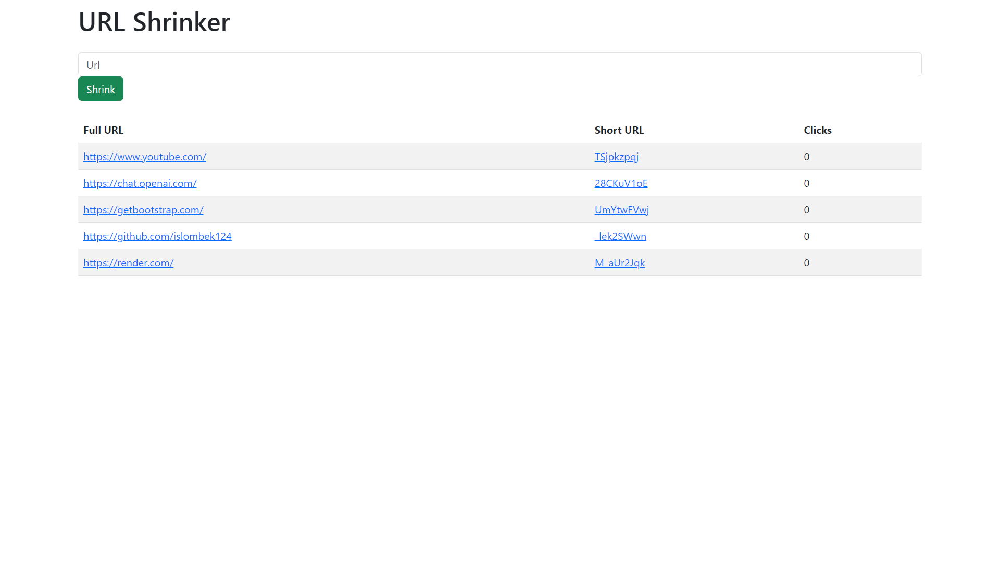

# URL Shortener App



This repository contains a simple URL shortener application built with Node.js, utilizing the dotenv package for environment variables and MongoDB for data storage.

## Features

- Shorten long URLs to short, manageable links.
- Store the original URL and corresponding shortened URL in the MongoDB database.
- Redirect users to the original URL when they visit the shortened link.

## Prerequisites

Make sure you have the following installed on your machine:

- Node.js: [Download and install Node.js](https://nodejs.org/).
- MongoDB: [Download and install MongoDB](https://www.mongodb.com/try/download/community).

## Installation

1. Clone the repository:

   ```bash
   git clone https://github.com/islombek124/url-shortener-nodejs.git
   ```

2. Navigate to the project directory:

   ```bash
   cd url-shortener-nodejs
   ```

3. Install the dependencies:

   ```bash
   npm install
   ```

4. Create a `.env` file in the root directory of the project and set the following environment variables:

   ```plaintext
   MONGO_URI=your_mongodb_connection_string
   PORT=3000
   ```

   Replace `your_mongodb_connection_string` with the actual MongoDB connection string, e.g., `mongodb://localhost:27017/url_shortener_db`.

5. Start the server:

   ```bash
   npm run dev
   ```

   The server should now be running at `http://localhost:3000`.

## Usage

- Access the URL Shortener App by visiting `http://localhost:3000` in your web browser.

- To shorten a URL, enter the long URL in the provided input field and click the "Shorten" button.

- The application will generate a shortened URL that you can copy and share.

- When users visit the shortened URL, they will be redirected to the original URL.

## Contributing

Contributions are welcome! If you find any bugs or want to improve the app, feel free to open an issue or submit a pull request.

## License

This project is licensed under the [MIT License](https://opensource.org/license/mit/).

## Acknowledgments

- This app is built using [Node.js](https://nodejs.org/), [Express](https://expressjs.com/), [dotenv](https://www.npmjs.com/package/dotenv), [MongoDB](https://www.mongodb.com/) and [ShortId](https://www.npmjs.com/package/shortid).
- The project structure is inspired by [Web Dev Simplified](https://github.com/WebDevSimplified).

## Disclaimer

This app is meant for educational and demonstration purposes only. It is not suitable for production environments without proper security measures and validations. Use at your own risk.
